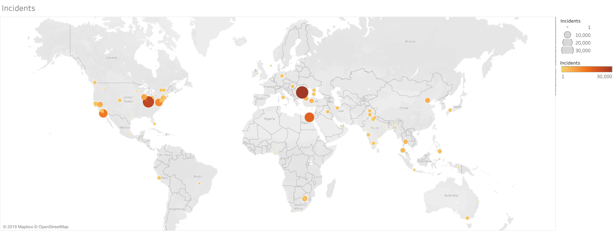
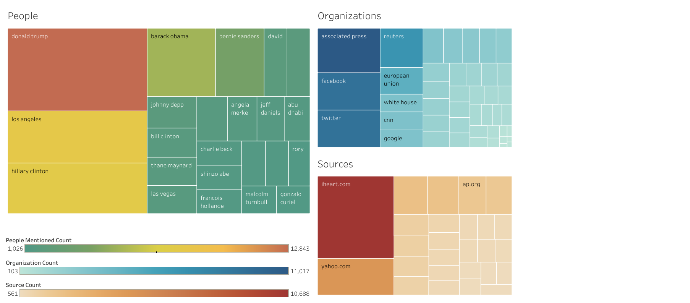

# Big Data Analytics with Hadoop: Worldwide News Database GDELT
This repository performs big data analysis using Hadoop on the [Global Database of Events, Language and Tone](https://www.gdeltproject.org/) (GDELT). The GDELT project is supported by Google Jigsaw and collates its information from broadcast, print and web news media from around the world. This data is open source and consists of CSV format datasets published daily.

For this project, I will be using the [GDELT 1.0 Global Knowledge Graph](http://data.gdeltproject.org/gkg/index.html) for the following reasons:
1.	The GDELT 1.0 GKG database allows for more varied and involved data processing and will also allow me to infer a vast amount of knowledge from its various columns of data.
2.	In contrast, the GDELT 1.0 Event Database only allows me to count the number of events that occurred in a period of time. For example, multiple events tagged under the keyword KILL might or might not be related. This allows me to have only a broad overview of the events of the world
3.	The GDELT 2.0 database is updated every 15 minutes. Hence, it is suitable for use with real-time decision making requirements. The Hadoop ecosystem is not natively efficient at performing real-time processing of data and works better with historical data. Hence, GDELT 1.0 is a better fit.

The code here is an attempt to understand and showcase how massive global news databases like GDELT could be used to understand the changing field of politics, perception of the public, disease outbreaks, civil unrests, etc.

## The GDELT Global Knowledge Graph
The GDELT GKG begins on April 1, 2013, until today (22nd November 2019 at time of writing). The description of the information available is given in the table below. Look at the [GDELT GKG 1.0 Data Format Codebook](http://data.gdeltproject.org/documentation/GDELT-Global_Knowledge_Graph_Codebook.pdf) for more details.

<table class="tg">
  <tr>
    <th class="tg-c3ow" colspan="2">Tab Delimited Columns of GEDLT GKG Database</th>
  </tr>
  <tr>
    <td class="tg-c3ow">DATE</td>
    <td class="tg-c3ow">In YYYYMMDD format (eg: 20160601)</td>
  </tr>
  <tr>
    <td class="tg-c3ow">NUMARTS</td>
    <td class="tg-c3ow">Number of articles related to events</td>
  </tr>
  <tr>
    <td class="tg-c3ow">COUNTS</td>
    <td class="tg-c3ow">List of all counts associated with the event, for multiple possible count types (eg: AFFECT, ARREST, KIDNAP, KILL, etc.)</td>
  </tr>
  <tr>
    <td class="tg-c3ow">THEMES</td>
    <td class="tg-c3ow">List of all themes found in the article</td>
  </tr>
  <tr>
    <td class="tg-c3ow">LOCATIONS</td>
    <td class="tg-c3ow">List of locations associated with event</td>
  </tr>
  <tr>
    <td class="tg-c3ow">PERSONS</td>
    <td class="tg-c3ow">List of persons associated with event</td>
  </tr>
  <tr>
    <td class="tg-c3ow">ORGANIZATIONS</td>
    <td class="tg-c3ow">List of organizations associated with event</td>
  </tr>
  <tr>
    <td class="tg-c3ow">TONE</td>
    <td class="tg-c3ow">List of numbers used to describe the tonality of the article</td>
  </tr>
  <tr>
    <td class="tg-c3ow">CAMEOEVENTIDS</td>
    <td class="tg-c3ow">List of integers to describe the event using the Conflict and Mediation Event Observations (CAMEO) IDs</td>
  </tr>
  <tr>
    <td class="tg-c3ow">SOURCES</td>
    <td class="tg-c3ow">List of sources</td>
  </tr>
  <tr>
    <td class="tg-c3ow">SOURCEURLS</td>
    <td class="tg-c3ow">For web articles, complete URL</td>
  </tr>
</table>

## Running the Code
The `\Code` folder contains multiple `Java` files which can be run using a Hadoop installation (either on a local machine or a cluster). The code performs the following analytics:
1. `ActivePeople.java` / `[attr]Count.java`: Counts the number of times each individual has been mentioned in the database (either summed over events / articles). Each `[attr]Count.java` counts some attribute of the database, such as people, countries, cities, sources, themes etc.
2. `CountryTone.java`: Filters and tabulates the tone of different articles related to each country.
3. `CountryNetwork.java` / `PeopleNetwork.java`: Crawls through the event database to create a network of countries/people which are mentioned together. Can be used to understand how close two countries are, or how often they are mentioned on popular new media together. In the case of people, can be used to associate groups of people together.
4. `PersonTone.java`: Filters the events to look for articles that mention a selected person, and tabulates the tone of those articles. Can be used to understand the public perception about a person, and how it changes. For example, during the 2016 US elections, can be used to see how many articles had a positive/negative tone related to Donald Trump vs Hillary Clinton.
5. `DeathToll.java`: Filters through the data to look for events that include the event type `KILL`, effectively counting the number of reported deaths at any given day.
6. `Experts.java`: Combs through the database to provide the names of people most commonly associated with a particular theme/subject.

## Example Outputs
THe following outputs were computed using the given code on the GDELT GKG file corresponding to **1st June 2016**. THis was quite close to the **2016 US Presidential Elections**, and hence we see this theme being very common in the below results. The visualizations were created using the free public version of [Tableau](https://www.tableau.com/). The network graph of people was created using the open-source graph visualization software [Gephi](https://gephi.org/). Sadly, Github does not support iFrames on MarkDown files. Therefore, to try out the interactive Tableau visualizations, just click on the images!

#### Worldwide Disruptive Incidents
The visualization below shows the number of incidents which were violent in nature occurring all across the world on 2016-06-01.

#### Most Frequently Mentioned
The visualization below shows treemaps of the ost frequently mentioned people, the most frequently mentioned organizations, and the most prolific sources of the articles collected by GDELT on 2016-06-01.

#### Public Perception using Tone
The graphs below show the distribution of tone of the different articles published on 2016-06-01. This includes the overall distribution for all events, on donald trump, on hilary clinton and on the countries US, UK and India.

#### Network of Countries
THe visualization below shows the countries that are most often mentioned together. Since this graph can include a lot of information, you can select the country of your choice, and this will display the connections of the chosen country with other countries. The width and color of those countries depends on how often they are mentioned together. The thicker and darker color the line, the more times they have been mentioned together.

#### Most mentioned cities and countries
The visualization below shows the most mentioned cities and countries.

#### Experts in their Fields
The visualization below allows you to select from a list of people and based on your selection creates a word cloud of the themes / topics which are associated with him / her. By default, the person selected is 'Hillary Clinton', keeping in mind that these topics are only for the articles published on 2016-06-01.

#### Network of People
The visualization below shows the network of people, with the edges being weighted based on how many times they are mentioned together in the same article.

We see some groups being formed in the network above. These groups can be broadly associated as belonging to some aspect of the public view, shown below.

It is also interesting to see how these different groups bleed into each other. For example, the network of people related to politics in US is closely connected to the network of people related to Hollywood / pop culture (such as Justin Beiber, Kim Kardashian, Johnny Depp etc.)